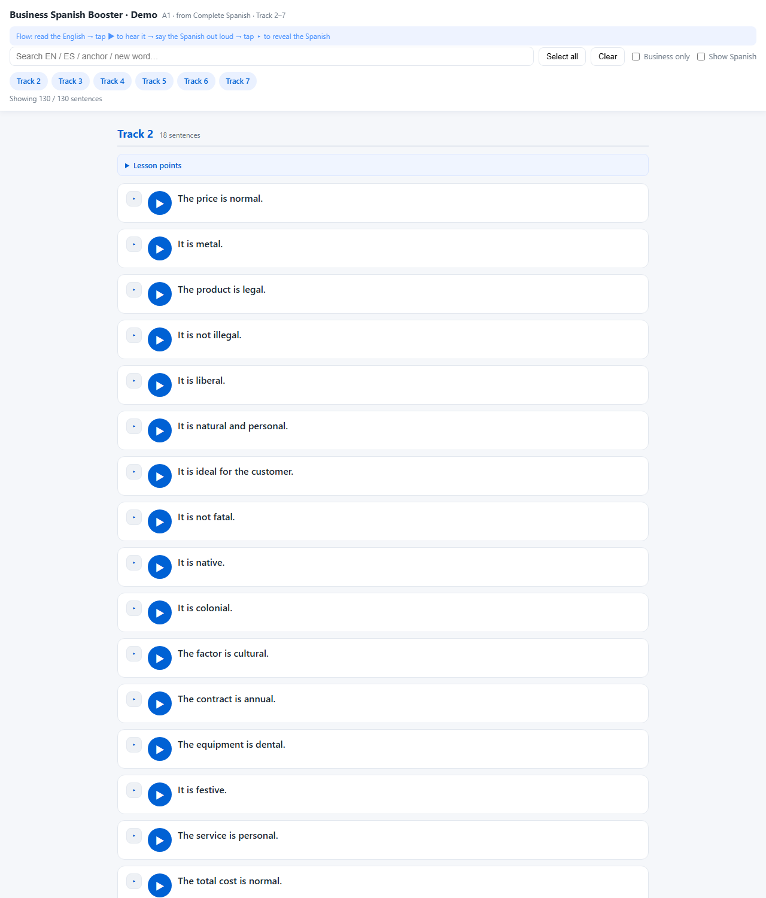

# SpanishLine — Free subtitles & interactive lessons for Language Transfer's Complete Spanish (all 90 lessons)

Hand-proofread, timestamp-aligned Spanish **subtitles** for the **entire 90-lesson** Language Transfer Complete Spanish course — plus **interactive lessons** you can open in any browser: tap any sentence to jump the audio, expand **Key Points** for the grammar behind it. Study anywhere, on any device. No signup, no cost.

> Language Transfer's course is free but ships **without subtitles or a built-in player**, which is the single biggest blocker for self-learners. This project fixes that — subtitles for all 90 lessons are free, and the paid packs add the full tap-and-learn player set with the audio embedded.

---

## ⬇ Download the Free pack (all 90 lessons)

Instant download, no email or signup:

> **[GitHub Releases → latest](https://github.com/xianggeaaa-ui/language-transfer-spanish-companion/releases/latest)** · **[OneDrive](https://1drv.ms/u/c/6840575711a774ed/IQDL4K8E_zhLRqVjCW1fv2BfAXBBraNOJdVkpu4RY3pKqoA?e=d1PBC4)** · **[Google Drive](https://drive.google.com/file/d/1YhqZWq9VSWpzGHF-Xi1TiGAAYBxQ8UIj/view?usp=sharing)**

What's inside the Free pack:

```
Language Transfer Spanish Companion - Subtitles (L01-90)/
├── 00-START-HERE.html            ← start here: what this is + how to learn with it
├── 01-README.html                ← full guide: method, audio, Anki, tiers, support
├── tap-and-learn/                ← 5 interactive demo players (Lessons 1–5)
│                                    audio embedded — tap a line, hear it again, works offline
├── subtitles-srt/                ← 90 hand-proofread .srt files (Lesson 01–90)
├── subtitles-lrc/                ← 90 matching .lrc files for lyric/mp3 players
├── Business Spanish Booster.html ← Booster sample: workplace Spanish, Lessons 2–31
└── screenshots/
```

## How to use it

1. **Download the free pack** (links above) and unzip it.
2. **Open `00-START-HERE.html`**, then try a demo player: `tap-and-learn/interactive-lessons-player-L01-demo.html` — audio is already embedded, works offline, no setup.
3. **Pair the subtitles with the official audio** (optional) — the course audio is free from Language Transfer: see [AUDIO-SOURCES.md](AUDIO-SOURCES.md) for the one-click download (https://downloads.languagetransfer.org/spanish/spanish.zip). Drop `Lesson NN.srt` next to the matching lesson audio; subtitles appear in any player (VLC, PotPlayer, Elmedia…). The `.lrc` files work in mp3 players / lyric apps.

### Try the Business Spanish Booster (interactive sample)



👉 **[Open the Booster sample](booster-demo.html)** — workplace Spanish with audio. Single self-contained HTML file, works offline. *(The Free pack includes the sample covering Lessons 2–31; the full Booster — 1,222 sentences across the whole course — ships in the Complete Pack.)*

---

## Support the project

SpanishLine stays free for everyone who can't pay. If you'd like to say thanks:

- ☕ **Ko-fi** (PayPal, USD) — [ko-fi.com/spanishline](https://ko-fi.com/spanishline) — tips only.

---

## License & credit

Subtitles and the Business Booster are based on Language Transfer's **free** Complete Spanish audio course, taught by Mihalis Eleftheriou.

- Audio and original course content: © Language Transfer — **not redistributed** in this repo. (Paid packs embed the audio inside the player HTML for offline personal study only; not re-disseminated further.)
- Subtitles, Booster flashcards, grammar notes, business sentences, Anki decks: © SpanishLine, for personal study only. Do not resell.

**Not affiliated with, endorsed by, or sponsored by Language Transfer.** This is a fan project. If you love the course, the strongest support is to [donate to Language Transfer directly](https://www.languagetransfer.org/).

Found a typo? Open an issue with the lesson number and timestamp — fixes ship in the next batch.

---

*spanishline — one line at a time.* 
